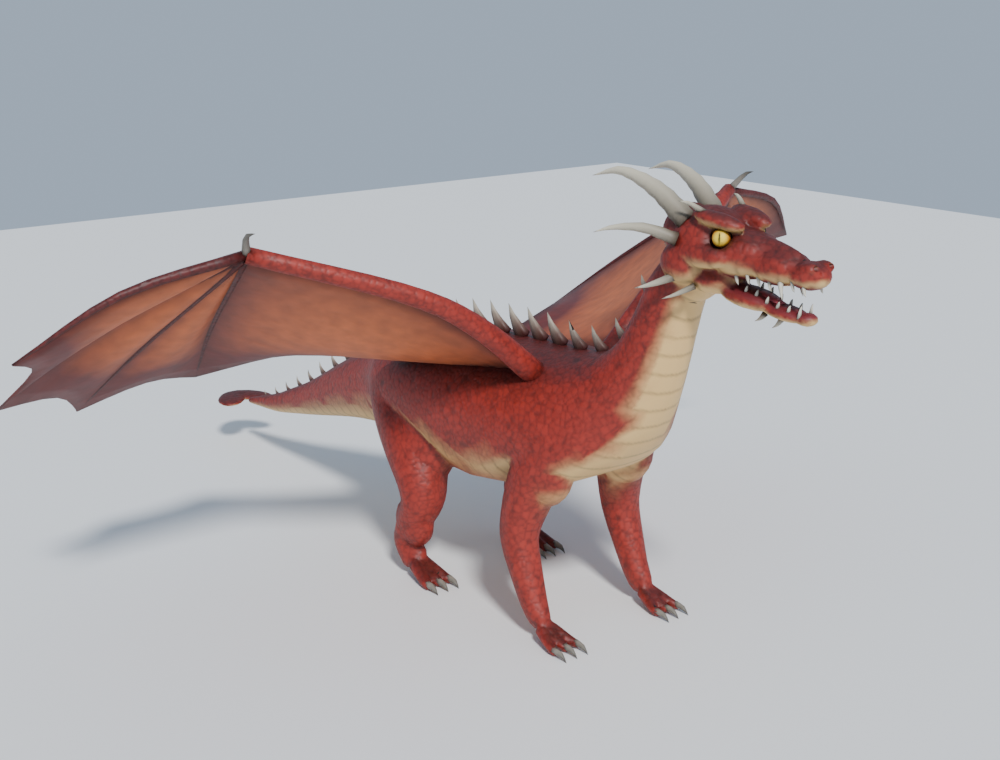

# Dragons for Roblox

Two versions, each one MeshPart when imported:

| | Detailed (HD) | Low-poly |
|---|---|---|
| Preview |  |  |
| Import file | `dragon_hd.fbx` | `dragon.fbx` |
| Triangles | 19,000 (Roblox limit 20,000) | ~4,000 |
| Textures | 1024px color map + normal map | 64px flat palette |
| Blender file | `dragon_hd.blend` | `dragon.blend` |
| Build script | `build_dragon_hd.py` | `build_dragon.py` |

The HD dragon has a sculpted head (brow ridges, eye sockets, cheekbones,
nostrils), slit-pupil eyes, an open mouth with teeth and tongue, ridged
horns, toes with claws, bat wings with a billowing membrane, and baked
scales, belly plates and shading. Close-up: `preview_hd_head.png`.

Both are about 16 × 16 × 8 units with the origin at the feet.

## Import into Roblox Studio
1. **Home → Import 3D** (or Avatar → Import 3D), then pick `dragon_hd.fbx`.
2. Click **Import**. You get a single MeshPart with its textures.
3. If the scales and bumps don't show, add a **SurfaceAppearance** to the
   MeshPart and set `ColorMap` to `dragon_hd_color.png` and `NormalMap` to
   `dragon_hd_normal.png` (upload them first).
4. Resize with the Scale tool if needed; if it faces the wrong way, rotate 180° on Y.

If the FBX gives trouble, try the `.glb` file instead.

## Change colors or shape
Edit the color constants or shape numbers at the top of the build script, then run:
```
blender --background --python build_dragon_hd.py
# or: pip install bpy && python build_dragon_hd.py
python render_preview.py   # re-render the HD preview images
```
