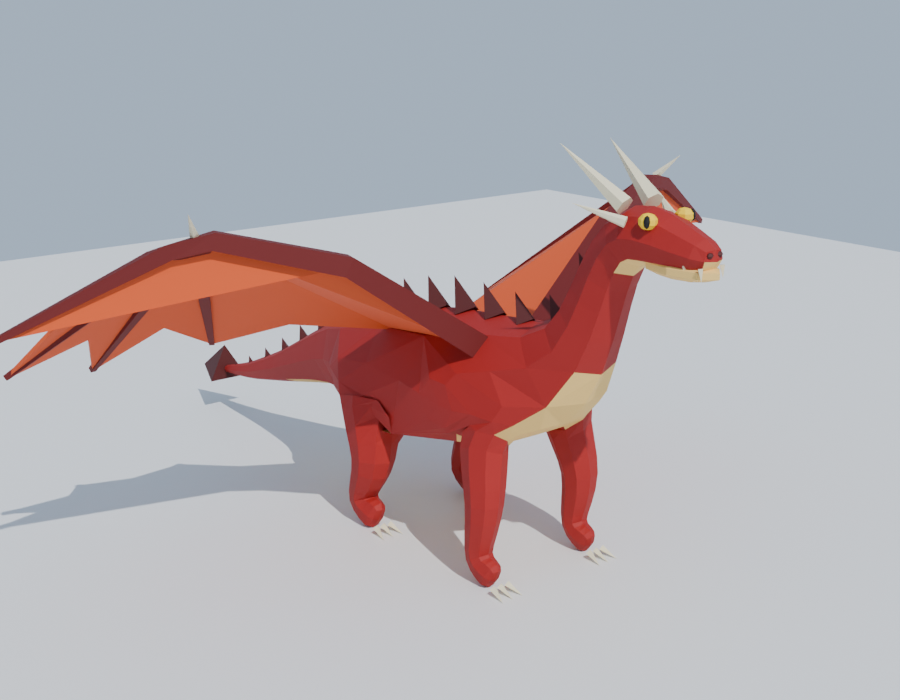

# Low-poly Dragon for Roblox



| File | Use |
|---|---|
| `dragon.fbx` | Import into Roblox Studio (texture embedded) |
| `dragon.glb` | Alternative import format |
| `dragon.blend` | Editable Blender file |
| `dragon_palette.png` | The 64×64 color palette texture (upload manually if Studio doesn't pick it up) |
| `build_dragon.py` | Script that generates everything; edit colors/shape and re-run |

**Stats:** one mesh, ~4,000 triangles (Roblox limit is 20,000), one texture, about 16 × 16 × 8 units, origin at the feet.

## Import into Roblox Studio
1. **Home → Import 3D** (or Avatar → Import 3D), then pick `dragon.fbx`.
2. Leave the default options and click **Import**. You get a single MeshPart with the texture applied.
3. Resize with the Scale tool if needed. If it faces the wrong way, rotate it 180° on Y.

## Change colors or shape
Edit `PALETTE` (or the skeleton points) in `build_dragon.py`, then run:
```
blender --background --python build_dragon.py
# or: pip install bpy && python build_dragon.py
```
